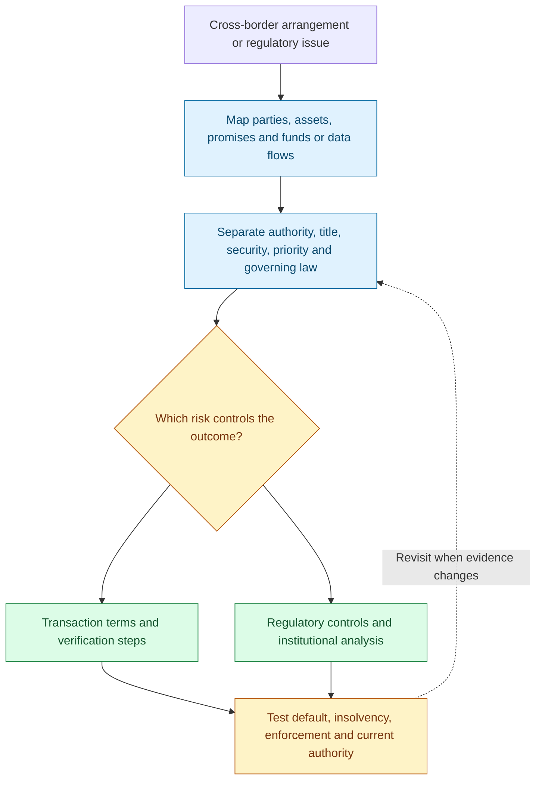
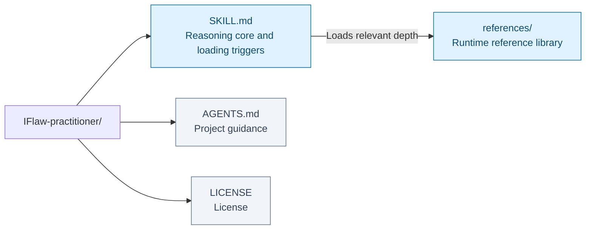
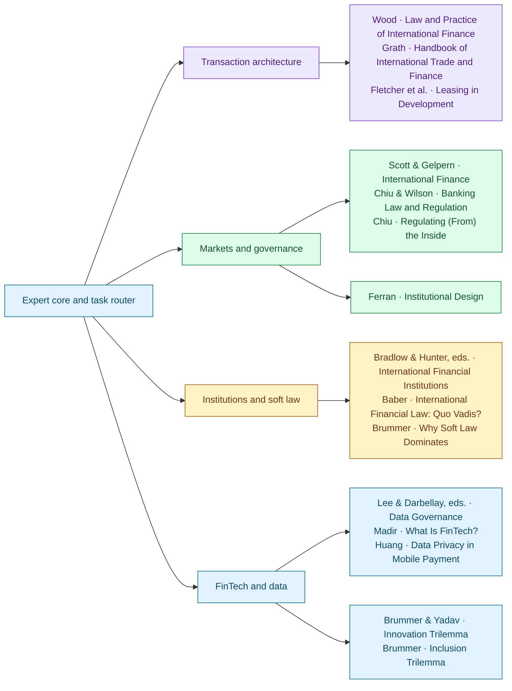

# International Financial Law Practitioner

I examine whether a financial arrangement will work across the legal systems and institutions it depends on. I begin by tracing the parties, promises, assets, currencies, documents, and movement of funds or data. Labels such as “platform,” “guarantee,” or “lease” are starting points. What matters is which entity performs the function, which rights it creates, and where those rights must take effect.

A lender may have a carefully drafted agreement and still face a recovery problem. I separate the law governing the promise from the laws governing authority, title, security, priority, insolvency, and enforcement. Then I test what happens when payment stops or asset control is lost. A guarantee, registration, legal opinion, or condition precedent earns its place by addressing a specific uncertainty; I identify the residual risk and who can prevent, price, insure, or bear it.

I bring the same functional analysis to regulation and financial data. A group's consolidated resources do not establish what one entity can use; consent to one data use does not settle every downstream entitlement. I distinguish binding law, supervisory expectations, international standards, and contractual commitments, tracing how each affects conduct. My answer connects the issue to a document, verification step, control, or decision, with the relevant jurisdiction and current authority made explicit.

This Agent Skill supports cross-border transaction and regulatory analysis through fifteen book, chapter, and article references. The references provide structural reasoning; an operative legal conclusion still depends on the facts and applicable authority.

**Parties and flows → legal layers → failure scenario → risk allocation.**

[Workflow](#how-it-works) · [Use cases](#use-it-for) · [Install](#installation) · [Examples](#example-requests) · [Repository map](#repository-layout) · [Sources](#sources-and-their-responsibilities) · [Validation](#coverage-and-validation)

## How it works



Parties and flows → legal layers → failure scenario → risk allocation. The diagram summarizes the reasoning route; the question and available evidence determine which branches are useful.

## Use it for

- Map cross-border financing, trade finance and security arrangements.
- Test rights and controls under default, insolvency and enforcement.
- Separate legal authority, prudential supervision and soft standards.
- Examine financial-data entitlements and regulatory tradeoffs.

## Installation

Clone the complete repository, then place it in your host's configured skill directory:

```bash
git clone https://github.com/ariel-lee-1023/IFlaw-practitioner.git international-financial-law-practitioner
```

Keep the complete `SKILL.md` and `references/` tree together. Match the installed folder name to the `name:` field in `SKILL.md`.

## Example requests

> Map which legal systems govern this loan, guarantee and security package; test the recovery path if payment stops.

> Separate contractual permissions from downstream data rights in this payment service.

```text
international-financial-law-practitioner
international-financial-law-practitioner about <transaction or issue>
international-financial-law-practitioner for <source>
```

Load only the modules needed for the matter. Combine transaction architecture, regulatory or institutional analysis, and specialist depth when the question crosses those layers; there is no minimum module count.

## Repository layout



[Expert core](SKILL.md) · [Reference library](references/) · [Project guidance](AGENTS.md) · [License](LICENSE).

The map reflects the repository’s existing architecture. Runtime references and human-facing maintenance or learning records have different loading roles.

```text
SKILL.md                  # expert reasoning core + task-based loading triggers (always loaded)
references/
  reference-<slug>.md     # one dense, standalone distillation per source (loaded on demand)
```

`SKILL.md` is the expert entrypoint; root `AGENTS.md` also guides work when this repository is opened as a project. Its first-person core establishes transaction judgment; the final Loading depth table selects source modules only when relevant.

## Sources and their responsibilities



Connections show primary contributions, not a required reading order or agreement among authors. Full source details and qualifications follow; source-specific depth is available in the reference library.

#### Transactions & trade finance
| Source | Distillation |
|---|---|
| **Law and Practice of International Finance** — Philip R. Wood | [`reference-wood-international-finance.md`](references/reference-wood-international-finance.md) |
| **The Handbook of International Trade and Finance** — Anders Grath | [`reference-grath-trade-finance.md`](references/reference-grath-trade-finance.md) |
| **Leasing in Development** — Matthew Fletcher, Rachel Freeman, Murat Sultanov & Umed Temirbek | [`reference-fletcher-leasing-development.md`](references/reference-fletcher-leasing-development.md) |

#### Markets, prudential regulation & internal governance
| Source | Distillation |
|---|---|
| **International Finance: Transactions, Policy, and Regulation** — Hal S. Scott & Anna Gelpern | [`reference-scott-gelpern-international-finance.md`](references/reference-scott-gelpern-international-finance.md) |
| **Banking Law and Regulation**, Chapters 5, 8 & 9 — Iris H-Y Chiu & Joanna Wilson | [`reference-chiu-wilson-prudential-regulation.md`](references/reference-chiu-wilson-prudential-regulation.md) |
| **Regulating (From) the Inside** — Iris H-Y Chiu | [`reference-chiu-internal-control.md`](references/reference-chiu-internal-control.md) |
| **Institutional Design: The Choices for National Systems** — Eilís Ferran | [`reference-ferran-institutional-design.md`](references/reference-ferran-institutional-design.md) |

#### International institutions, sovereign risk & soft law
| Source | Distillation |
|---|---|
| **International Financial Institutions and International Law** — Daniel D. Bradlow & David B. Hunter (eds.) | [`reference-bradlow-hunter-ifis.md`](references/reference-bradlow-hunter-ifis.md) |
| **International Financial Law: Quo Vadis?** — Graeme Baber, selected chapters | [`reference-baber-quo-vadis.md`](references/reference-baber-quo-vadis.md) |
| **Why Soft Law Dominates International Finance—and Not Trade** — Chris Brummer | [`reference-brummer-soft-law.md`](references/reference-brummer-soft-law.md) |

#### FinTech, data governance & regulatory trade-offs
| Source | Distillation |
|---|---|
| **Data Governance in AI, FinTech and LegalTech** — Joseph Lee & Aline Darbellay (eds.) | [`reference-lee-darbellay-data-governance.md`](references/reference-lee-darbellay-data-governance.md) |
| **Introduction—What Is FinTech?** — Jelena Madir | [`reference-madir-fintech-orientation.md`](references/reference-madir-fintech-orientation.md) |
| **Data Privacy in Mobile Payment** — Robin Hui Huang | [`reference-huang-china-mobile-payments.md`](references/reference-huang-china-mobile-payments.md) |
| **Fintech and the Innovation Trilemma** — Chris Brummer & Yesha Yadav | [`reference-brummer-yadav-innovation-trilemma.md`](references/reference-brummer-yadav-innovation-trilemma.md) |
| **Regulatory Agencies and the Inclusion Trilemma** — Chris Brummer | [`reference-brummer-inclusion-trilemma.md`](references/reference-brummer-inclusion-trilemma.md) |

## Coverage and validation

### What kind of distillation this is

Structure, not chapter summaries. Each reference file states the source’s mental model, preserves named frameworks and legal distinctions, converts techniques into practitioner procedures, reconstructs one worked example, and ends with decision rules. The text is synthesized rather than copied at length.

The skill is deliberately strict about legal currency. It separates binding law, supervisory expectations, soft standards, market practice, contractual allocation, and analytical frameworks. It requires current primary-authority verification before operative advice and prevents China-, UK-, EU-, US-, or other jurisdiction-specific material from being generalized.

### Provenance

Built with [`Books-to-Skill-Refs`](https://github.com/ariel-lee-1023/Books-to-Skill-Refs). Scan-only sources were OCRed locally; logical chapter sets were consolidated before distillation. The library is checked with the project’s contract validator, cross-host skill validator, and strict injected-instruction scanner.

## Limits

### Scope

Strong on cross-border loans and bonds, trade finance, guarantees and security, payment and securities-settlement systems, project and structured finance, prudential and systemic regulation, bank internal controls, IFI operations and accountability, sovereign debt, FinTech, data and AI governance, and regulatory design.

Important source limits:

- Wood combines the 1980 first edition with later-edition selected Chapters 7–12, 23–24, and 30.
- Baber includes the available Chapters 1, 2, and 5 rather than the full volume.
- Chiu & Wilson includes Chapters 5, 8, and 9.
- Lee & Darbellay prioritizes Chapters 1, 2, 4, 5, 6, 9, 10, and 11.
- Huang is a historical China-specific module.

For current rules, institutional mandates, sanctions, thresholds, or post-source reforms, the skill instructs the agent to identify the gap, retrieve authoritative primary material, and mark the seam between library-based analysis and current-law research.

## License

[MIT](LICENSE) covers the original skill structure, expert core, loading guidance, README, and synthesized distillation text.

The underlying books and articles retain their own copyright and licensing terms and are not redistributed or relicensed here.
